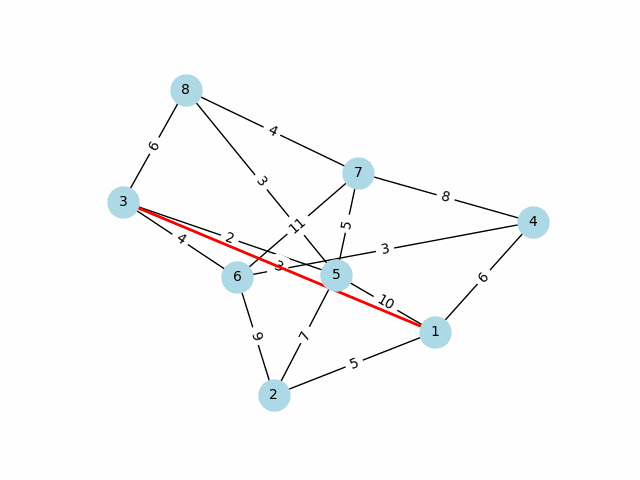

# Dijkstra's Algorithm Visualization

This repository demonstrates Dijkstra's algorithm for finding the shortest path in a weighted graph.

## Example Output

## How to Use
Run the script to visualize the shortest path in a given graph.
